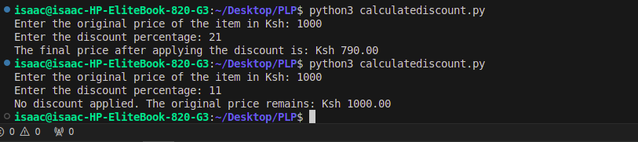

# Discount Calculator

## Overview
This Python program calculates the final price of an item after applying a discount. The discount is applied only if it is 20% or more of the original price. If the discount is less than 20%, the program returns the original price without any modifications.

## Features
- Calculates the discounted price based on the given discount percentage.
- Applies the discount only if the percentage is 20% or greater.
- Prompts the user for the original price and the discount percentage.
- Provides a clear output on the final price after discount or if no discount is applied.

## Screenshot

## Installation

No installation is required to run this script as it only requires Python to be installed on your system.

1. Ensure that you have Python installed. You can download it from the [official website](https://www.python.org/downloads/).
2. Save the Python script file on your local machine.

## Usage

1. **Clone or download** the repository to your local machine.
2. Open a terminal or command prompt in the directory where the script is located.
3. Run the script by executing the following command:
   python calculatediscount.py
